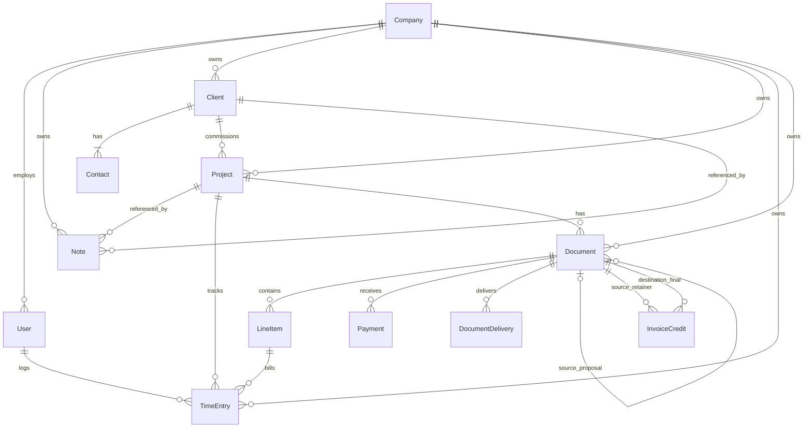

# Data Model Design

This document maps the MVP entities, ownership paths, constraints, and computed
values. The Word specification remains authoritative for the full field list.

## Relationship map



## Ownership model

Direct company ownership is stored on `User`, `Note`, `Client`, `Project`,
`TimeEntry`, and `Document`. Child objects derive ownership from a parent to avoid
duplicated company columns that could disagree:

| Child | Ownership path |
| --- | --- |
| `Contact` | `client.company` |
| `LineItem` | `document.company` |
| `Payment` | `document.company` |
| `InvoiceCredit` | `source_invoice.company` and `destination_invoice.company` must match |
| `DocumentDelivery` | `document.company` |

The direct `company` on `TimeEntry` is intentional even though project and user
also imply it: it is a top-level reportable record and the brief explicitly
requires it. Validation requires all three ownership paths to agree.

## Field conventions

Use these conventions unless a decision is superseded before its phase starts:

| Value | Suggested database representation |
| --- | --- |
| Money totals and payment amounts | `DecimalField(max_digits=12, decimal_places=2)` |
| Rates used in multiplication | `DecimalField(max_digits=12, decimal_places=4)` |
| Quantities/hours | `DecimalField(max_digits=10, decimal_places=2)` |
| Tax percentages | `DecimalField(max_digits=6, decimal_places=3)` |
| Public token | indexed unique `UUIDField(default=uuid.uuid4, editable=False)` |
| Timestamps | aware UTC `DateTimeField`; localize only for display |
| Ordered proposal sections | validated JSON list of `{heading, body}` objects |

Money fields use validators and database checks to reject invalid negative values.
Blank text fields store `""`; optional relationships/dates use `NULL`.

## Database constraints and indexes

| Record | Database rule | Service/form rule |
| --- | --- | --- |
| User | unique email | company required for non-bootstrap use |
| Project | unique `(company, number)` | billing rate/fee required by billing type |
| Contact | conditional unique primary per client | client create/update leaves exactly one primary |
| TimeEntry | conditional unique running entry per user; end after start | user/project/company match; invoiced entries locked |
| Document | unique `(company, doc_type, number)`; unique public token | type-specific fields/status; project/company match |
| LineItem | nonnegative quantity/rate/tax; unique `(document, order)` | document must be editable draft |
| Payment | positive amount; unique nonblank Stripe Payment Intent ID | document is invoice; amount does not unintentionally overpay |
| InvoiceCredit | positive amount; source/destination pair rules | paid retainer -> final invoice, same project/company, within availability |
| Note | none beyond ownership FKs | selected project determines client; unrelated client rejected |

Useful query indexes:

- Note: `(company, is_archived, -created_at)`
- Client: `(company, company_name)` plus contact last-name search support
- Project: `(company, -number)` and `(company, status)`
- TimeEntry: `(company, project, start_time)` and `(company, status, billable)`
- Document: `(company, doc_type, status)`, `(company, project, doc_type)`, and
  `(company, due_date)`
- Payment: `(document, received_at)`

PostgreSQL constraints should be named explicitly so migrations and integrity
errors remain diagnosable.

## Cross-row invariants

Some requirements cannot be guaranteed by a simple check constraint:

### Primary contacts

A conditional unique constraint guarantees *at most* one primary Contact. Client
creation and contact-management services run transactionally to guarantee *at
least* one. The UI edits the contact set as a unit so it cannot temporarily save
a client with no primary contact.

### Project and document numbers

Project numbering requires a monthly company sequence. Allocate the next
`YYMM###` value inside a transaction and retain the unique constraint as the final
collision guard. User overrides are validated against the same company scope.

Document number formats still need a product decision. The allocation service
must be independent of display format and safe under concurrent requests. A
small locked sequence record is preferable to `max(number) + 1`.

### Running timers

Starting a timer is atomic. The service checks for an existing running entry and
the conditional unique constraint handles a race. Elapsed duration is always
`effective_end - start_time`, where `effective_end` is now for a running entry.
No duration column is stored.

### Accepted proposals

Acceptance fields form one immutable snapshot on the preserved Document:
signer name/email, accepted total, response timestamp, and IP. Acceptance and the
project transition occur in one transaction. Repeated submissions return the
already-recorded result rather than rewriting signer data.

### Retainer credits

For a retainer invoice `R`:

```text
available credit(R) = successful payments(R) - sum(source credits from R)
```

For a final invoice `F`, applied credits must not exceed either the combined
available retainers or the current charges plus tax on `F`. Source retainer,
destination invoice, and existing credits are locked while applying a credit.

## Derived values

Derived values are implemented in query/service helpers so lists, detail pages,
PDFs, and dashboards use the same definitions.

| Value | Definition |
| --- | --- |
| Time duration | `end_time - start_time`; current time when running |
| Project actual hours | sum of all completed TimeEntry durations |
| Effective hourly rate | fixed fee or project invoiced charges divided by actual hours; blank at zero hours |
| Line total | rounded `rate * quantity` |
| Subtotal | sum of line totals |
| Tax total | sum of rounded per-line tax |
| Credit total | sum of valid destination InvoiceCredits |
| Document total | subtotal + tax total - credit total, never below zero |
| Amount paid | sum of Payment amounts for the invoice |
| Outstanding balance | max(document total - amount paid, 0) |
| Overdue | non-void invoice with balance > 0 and due date before local today |
| Received revenue | sum of Payment amounts in the selected received-date period |

## Implementation staging

Phase 2 creates `TimeEntry` with its timer, reporting, status, and billing flags.
The nullable `line_item` relationship is intentionally added in the Phase 3
documents migration, when `LineItem` first exists. No time can be marked invoiced
through the Phase 2 interface, so this staging does not create an unattached
invoiced state in normal use.

## Document subtype validation

One `Document` table intentionally serves proposals and invoices. Validation must
make impossible combinations explicit:

- Proposals require proposal status choices and allow body sections; they have no
  invoice kind, due date, payments, or credits.
- Invoices require invoice status choices, invoice kind, and due date; they do not
  use proposal body sections or acceptance fields.
- `source_proposal`, when present, points to an accepted proposal for the same
  project and company.
- Retainer invoices may source credits; final invoices may receive credits.
- Payment and Pay Now actions accept only non-void invoices with a positive
  outstanding balance.

Where conditional database checks become too opaque, keep the database rule
simple and put the full error-producing validation in the service, backed by
tests.

## Supporting record required by the screens

The screen specification asks for recipient selection and send history, which
cannot be represented by `Document.sent_at` alone. Add:

### DocumentDelivery

| Field | Purpose |
| --- | --- |
| `document` | parent proposal/invoice |
| `recipient_name` | snapshot at send time |
| `recipient_email` | snapshot at send time |
| `status` | pending, sent, or failed |
| `provider_message_id` | optional delivery-provider reference |
| `error_code` | safe diagnostic category, no credentials/body |
| `created_at`, `sent_at` | attempt and success timestamps |

One send action may create multiple delivery rows. The document becomes `sent`
after the first successful delivery and `sent_at` records that first success.
Failures remain in history and can be retried without fabricating a successful
send.

## Deletion behavior

| Record | Rule |
| --- | --- |
| Client/Project | protect when financial history exists; cancel/archive instead of cascading loss |
| Draft Document | delete allowed; release attached time in the same transaction |
| Sent Proposal | withdraw only |
| Sent Invoice | void only |
| Accepted Proposal | permanent |
| Paid Invoice, Payment, InvoiceCredit | permanent through ordinary UI |
| Note | archive in ordinary flow; administrative deletion is exceptional |

Foreign-key `on_delete` choices should favor `PROTECT` across financial and
project history. Cascades are appropriate only for unsent draft-owned content
whose parent deletion is itself allowed.
