# Screen and Workflow Design

## Information architecture

The authenticated application uses one persistent shell:

- **Top bar:** company identity, current timer, user menu
- **Sidebar:** Quick note, Dashboard, Clients, Projects, Proposals, Invoices,
  Time, Revenue, Settings
- **Main region:** page title, primary action, filters/attention summary, content
- **Narrow screens:** sidebar collapses; quick note and timer remain one-tap
  actions

Quick capture and the running timer are global because they represent interrupt-
driven work. Other create actions live on the relevant list/detail page.

## Proposed route map

Route names are illustrative but should remain stable once templates depend on
them.

```text
/
  dashboard
/notes/
  list, edit, attach, archive, create-client
/clients/
  list, create, detail, edit
  /<id>/contacts/...
/projects/
  list, create, detail, edit, transition
  /<id>/timer/start
  /<id>/proposals/new
  /<id>/invoices/new
/time/
  list, manual-create, edit, stop, release
/proposals/
  list, detail, edit, preview, send, withdraw
/invoices/
  list, detail, edit, preview, send, void, record-payment, release-time
/revenue/
/settings/company/
/d/<uuid:public_token>/
  view, proposal-accept, proposal-decline, invoice-checkout
/webhooks/stripe/
```

Authenticated URLs may expose normal integer IDs because authorization never
depends on obscurity; every lookup is company-scoped. Public URLs expose only the
UUID token.

## Screen responsibility map

| Screen | Primary job | Primary action | Important secondary actions |
| --- | --- | --- | --- |
| Dashboard | show work needing attention | capture note | resume project, open draft/unpaid item |
| Notes | empty the intake inbox | add note | attach, create client, archive |
| Client detail | understand one billing relationship | create project | edit contacts/address, review history |
| Project detail | operate one job | next workflow action | timer, notes, documents, status, profitability |
| Time | reconcile work sessions | add manual entry | filter, edit logged time, open project |
| Proposal detail | prepare and manage agreement | preview/send | edit draft, accept history, withdraw |
| Invoice detail | issue and reconcile a bill | preview/send or record payment | apply credit, void, release time |
| Public document | let client review/respond/pay | accept or pay | decline proposal, download PDF |
| Revenue | verify received cash | choose period | open payment/invoice source |
| Settings | maintain document identity/defaults | save company settings | verify integrations |

## Core workflow map

```mermaid
flowchart LR
    A[Quick note] --> B[Client + primary contact]
    B --> C[Lead project]
    C --> D[Proposal draft]
    D --> E[Sent / viewed]
    E --> F[Accepted]
    F --> G[Approved project]
    G --> H[Retainer invoice]
    H --> I[Payment]
    I --> J[Active project]
    J --> K[Tracked work]
    K --> L[Final invoice + retainer credit]
    L --> M[Final payment]
    M --> N[Explicit project completion]
```



The Project detail page is the workflow hub. Its primary button changes with
state rather than presenting every possible action at once:

| Project condition | Primary next action |
| --- | --- |
| Lead, no proposal | Create proposal |
| Lead, draft proposal | Continue proposal |
| Lead, sent proposal | View proposal status |
| Approved, retainer expected | Create/open retainer invoice |
| Approved, no retainer | Start project |
| Active | Start/continue timer |
| Active with finished work | Create final invoice |
| Final invoice unpaid | Open invoice |
| Final invoice paid | Mark project completed |

## Dashboard design

The dashboard is an attention queue, not an analytics page. Put immediate capture
first, then exceptional/actionable groups:

1. Quick note input and running timer
2. Leads requiring proposal action
3. Approved projects awaiting retainer/start
4. Active projects and unbilled time
5. Draft documents
6. Unpaid and overdue invoices
7. Current-month received revenue

Each count links to the exact filtered list that produced it. Empty groups collapse
to a small success/empty state instead of consuming a full card.

Implemented in Phase 6: project status filters, the unbilled-time filter, combined
draft-document list, outstanding/overdue invoice lists, received-revenue month
navigation, and company/integration settings are the reconciliation targets for
these dashboard links.

## Quick-note interaction

- The shell contains one multiline text box and a Save action.
- Body is the only required input; Enter behavior must not cause accidental save
  while typing multiline notes.
- Successful save clears the field, confirms capture, and does not navigate away.
- Optional client/project attachment happens later on the Notes screen.
- Selecting a project automatically displays/derives its client; the client cannot
  be independently changed to an unrelated record.
- Create client from note carries the original note context through the flow and
  archives only after the user confirms the conversion.

The five-second requirement should be tested from a loaded authenticated screen,
not from initial login.

## Timer interaction

The persistent widget has only two modes:

- **Stopped:** project selector, short description, Start
- **Running:** project/description, elapsed display, Stop, link to project

Starting creates the server record first; JavaScript then renders elapsed time
from the returned `start_time`. Reloading rehydrates from the server. If a start
race hits the unique constraint, the response returns the already-running entry
rather than displaying a generic server error.

Timer edits happen on the Time screen. Entries attached to invoice lines display
their invoice and remain locked unless released through the invoice workflow.

## Document editor

Use a shared proposal/invoice editor shell with subtype sections:

1. project, document number, dates, and recipients
2. proposal body sections when applicable
3. ordered pricing line items
4. hourly time selection/grouping for eligible final invoices
5. tax and retainer-credit section
6. terms and notes
7. totals and validation summary
8. Save draft, Preview, and Send actions

Preview opens the exact public rendering context without stamping `viewed_at`.
In Phase 4, Issue confirms the final total and activates the stable public link.
Draft edits remain possible until issue; issued records move to lifecycle actions
rather than returning to an editable draft. Phase 5 adds recipient selection,
outbound email, and delivery history as one auditable send workflow.

## Public proposal

The public page shows company letterhead, client/project/site, proposal body,
pricing, terms, total, and current state. It never includes internal notes.

Accept opens a short confirmation form containing signer name and email. The
server reloads and locks the proposal before accepting. After success, refresh or
repeat submission shows the immutable accepted confirmation. Decline requires a
confirmation but no account.

Withdrawn proposals display a closed-document notice with no response controls.

## Public invoice

The public page shows charges, per-line tax, a distinct retainer-credit section,
payments received, outstanding balance, due date, and status. `Pay Now` appears
only when all are true:

- document is a non-void sent/viewed/partially-paid invoice;
- online payments are enabled for the document and correctly configured;
- outstanding balance is positive.

Void invoices show a closed notice. Paid invoices show a receipt-like state and
never offer another Checkout Session.

## Error and confirmation behavior

- Cross-company or invalid object IDs return a generic not-found response.
- Financial state conflicts explain that the record changed and reload current
  state; they do not silently overwrite it.
- Destructive lifecycle actions (withdraw, void, release invoiced time) use a
  dedicated confirmation page/modal with the consequence stated plainly.
- Validation errors keep entered draft content and place a summary before the
  first invalid section.
- Provider failures create a visible retryable delivery/payment message without
  changing the underlying document to a false success state.

## Accessibility and responsive baseline

- All flows work with keyboard and visible focus.
- Status is expressed with text as well as color.
- Tables collapse into labeled rows/cards on narrow screens; money columns remain
  aligned and readable.
- Timer controls and quick capture meet touch-target sizing.
- Public documents use semantic headings and print without authenticated shell UI.
- Confirmation dialogs return focus to the triggering control when canceled.
