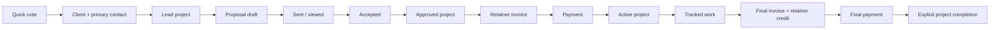

# Screen and Workflow Design

## Information architecture

The authenticated application uses one persistent shell:

- **Top bar:** company identity, current timer, user menu
- **Sidebar:** Quick note, Dashboard, Clients, Projects, Proposals, Invoices,
  Time, Revenue & Fees, Settings
- **Main region:** page title, primary action, filters/attention summary, content
- **Narrow screens:** sidebar collapses; quick note and timer remain one-tap
  actions

Quick capture and the running timer are global because they represent interrupt-
driven work. Other create actions live on the relevant list/detail page.

## Proposed route map

Route names are illustrative but should remain stable once templates depend on
them.

```text
/
  dashboard
/notes/
  list, edit, attach, archive, create-client
/clients/
  list, create, detail, edit
  /<id>/contacts/...
/projects/
  list, create, detail, edit, transition
  /<id>/timer/start
  /<id>/proposals/new
  /<id>/invoices/new
/time/
  list, manual-create, edit, stop, release
/proposals/
  list, detail, edit, preview, send, withdraw
/invoices/
  list, detail, edit, preview, send, void, record-payment, release-time
/revenue/
/settings/company/
/d/<uuid:public_token>/
  view, proposal-accept, proposal-decline, invoice-checkout
/webhooks/stripe/
```

Authenticated URLs may expose normal integer IDs because authorization never
depends on obscurity; every lookup is company-scoped. Public URLs expose only the
UUID token.

## Screen responsibility map

| Screen | Primary job | Primary action | Important secondary actions |
| --- | --- | --- | --- |
| Dashboard | show work needing attention | capture note | resume project, open draft/unpaid item |
| Notes | empty the intake inbox | add note | attach, create client/project, archive |
| Client detail | understand one billing relationship | create project | edit contacts/address, review history |
| Project detail | operate one job | next workflow action | timer, notes, documents, status, profitability |
| Time | reconcile work sessions | add manual entry | filter, edit logged time, open project |
| Proposal detail | prepare and manage agreement | preview/send | edit draft, accept history, withdraw |
| Invoice detail | issue and reconcile a bill | preview/send or record payment | apply credit, void, release time |
| Public document | let client review/respond/pay | accept or pay | decline proposal, download PDF |
| Revenue & Fees | reconcile annual cash receipts, Stripe fees, and adjustments | choose period/method/fee status or export CSV | filter to pending fees, inspect latest retry result, retry fees, print, open invoice source |
| Settings | maintain document identity/defaults | save company settings | verify integrations |

## Core workflow map


```mermaid
flowchart LR
    A[Quick note] --> B[Client + primary contact]
    B --> C[Lead project]
    C --> D[Proposal draft]
    D --> E[Sent / viewed]
    E --> F[Accepted]
    F --> G[Approved project]
    G --> H[Retainer invoice]
    H --> I[Payment]
    I --> J[Active project]
    J --> K[Tracked work]
    K --> L[Final invoice + retainer credit]
    L --> M[Final payment]
    M --> N[Explicit project completion]
```

The Project detail page is the workflow hub. A compact, guarded status selector
is visible in the page heading beside Edit project details; status is not part of
the project-detail edit form. Its primary workflow button changes with state
rather than presenting every possible action at once:

| Project condition | Primary next action |
| --- | --- |
| Lead, no proposal | Create proposal |
| Lead, draft proposal | Continue proposal |
| Lead, sent proposal | View proposal status |
| Approved, retainer expected | Create/open retainer invoice |
| Approved, no retainer | Start project |
| Active | Start/continue timer |
| Active with finished work | Create final invoice |
| Final invoice unpaid | Open invoice |
| Final invoice paid | Mark project completed |

## Dashboard design

The dashboard is an attention queue, not an analytics page. Put immediate capture
first, then exceptional/actionable groups:

1. Quick note input and running timer
2. Leads requiring proposal action
3. Approved projects awaiting retainer/start
4. Active projects and unbilled time
5. Draft documents
6. Unpaid and overdue invoices
7. Current-month received revenue

Each count links to the exact filtered list that produced it. Empty groups collapse
to a small success/empty state instead of consuming a full card.

Implemented in Phase 6: project status filters, the unbilled-time filter, combined
draft-document list, outstanding/overdue invoice lists, received-revenue month
navigation, and company/integration settings are the reconciliation targets for
these dashboard links.

## Quick-note interaction

- The shell captures the caller's optional first name, last name, and company,
  plus one multiline note and a Save action.
- Body is the only required input; Enter behavior must not cause accidental save
  while typing multiline notes.
- Successful save clears the field, confirms capture, and does not navigate away.
- Optional client/project attachment or conversion happens later on the Notes
  screen.
- Selecting a project automatically displays/derives its client; the client cannot
  be independently changed to an unrelated record.
- Create client from note prefills the captured identity and can continue directly
  to project creation. Project conversion prefills the linked client, its billing
  address, and the note body, then attaches the note to the new lead project.

The five-second requirement should be tested from a loaded authenticated screen,
not from initial login.

## Timer interaction

The persistent widget has only two modes:

- **Stopped:** project selector, short description, Start
- **Running:** project/description, elapsed display, Stop, link to project

Starting creates the server record first; JavaScript then renders elapsed time
from the returned `start_time`. Reloading rehydrates from the server. If a start
race hits the unique constraint, the response returns the already-running entry
rather than displaying a generic server error.

Timer edits happen on the Time screen. Entries attached to invoice lines display
their invoice and remain locked unless released through the invoice workflow.

## Document editor

Use a shared proposal/invoice editor shell with subtype sections:

1. project, document number, dates, and recipients
2. proposal body sections when applicable
3. ordered pricing line items
4. hourly time selection/grouping for eligible final invoices
5. tax and retainer-credit section
6. terms and notes
7. totals and validation summary
8. Save draft, Preview, and Send actions

Preview opens the exact public rendering context without stamping `viewed_at`.
In Phase 4, Issue confirms the final total and activates the stable public link.
Draft edits remain possible until issue; issued records move to lifecycle actions
rather than returning to an editable draft. Phase 5 adds recipient selection,
outbound email, and delivery history as one auditable send workflow.

## Public proposal

The public page shows company letterhead, client/project/site, proposal body,
pricing, terms, total, and current state. It never includes internal notes.

Accept opens a short confirmation form containing signer name and email. The
server reloads and locks the proposal before accepting. After success, refresh or
repeat submission shows the immutable accepted confirmation. Decline requires a
confirmation but no account.

Withdrawn proposals display a closed-document notice with no response controls.

## Public invoice

The public page shows charges, per-line tax, a distinct retainer-credit section,
payments received, outstanding balance, due date, and status. `Pay Now` appears
only when all are true:

- document is a non-void sent/viewed/partially-paid invoice;
- online payments are enabled for the document and correctly configured;
- outstanding balance is positive.

Void invoices show a closed notice. Paid invoices show a receipt-like state and
never offer another Checkout Session.

## Error and confirmation behavior

- Cross-company or invalid object IDs return a generic not-found response.
- Financial state conflicts explain that the record changed and reload current
  state; they do not silently overwrite it.
- Destructive lifecycle actions (withdraw, void, release invoiced time) use a
  dedicated confirmation page/modal with the consequence stated plainly.
- Validation errors keep entered draft content and place a summary before the
  first invalid section.
- Provider failures create a visible retryable delivery/payment message without
  changing the underlying document to a false success state.

## Accessibility and responsive baseline

- All flows work with keyboard and visible focus.
- Status is expressed with text as well as color.
- Tables collapse into labeled rows/cards on narrow screens; money columns remain
  aligned and readable.
- Timer controls and quick capture meet touch-target sizing.
- Public documents use semantic headings and print without authenticated shell UI.
- Confirmation dialogs return focus to the triggering control when canceled.

## AI-assisted document drafting

The assistant may gather company-scoped project context and prepare a financial
**draft** only after a visible confirmation card.

### Proposal draft

1. Resolve one project and gather company defaults.
2. Present the proposed scope sections, pricing lines, dates, and calculated
   totals.
3. Confirm creates a normal Draft proposal through the existing services.
4. The browser opens the standard proposal editor for review.
5. No issue, public access, recipient selection, or delivery attempt occurs.

### Retainer draft

1. Resolve one accepted proposal.
2. Show accepted total, existing retainers, proposed percentage/fixed amount,
   dates, and payment setting.
3. Confirm creates a normal Draft retainer through the accepted-proposal service.
4. The standard invoice editor remains the only place to review and later issue.

### Final invoice draft

1. Resolve one project and eligible unbilled time.
2. For hourly projects, show selected entries, grouping, hours, and client-facing
   descriptions. Original TimeEntry descriptions remain unchanged.
3. For fixed-fee projects, use the stored project fee.
4. Show each paid retainer credit and the resulting draft balance.
5. Confirm calls the existing time-attachment and credit services, then opens the
   standard invoice editor.

### Revise an existing draft

1. The user explicitly asks to revise a proposal or invoice and identifies the
   draft by document number or an unambiguous project/client reference.
2. The assistant reads only a company-owned document with `status=draft` and
   returns the current editable fields and safe line identifiers.
3. Proposal revisions may replace sanitized scope sections and pricing lines. The
   confirmation shows the prior and proposed total.
4. Invoice revisions may change issue/due dates, terms, internal notes, online
   payment setting, and selected client-facing line descriptions. Rates,
   quantities, taxes, credits, time-entry links, and totals are preserved.
5. Confirmation rechecks a metadata snapshot. Any intervening normal-UI edit
   invalidates the action.
6. A successful revision remains Draft and opens the normal editor. It is not
   issued, made public, or emailed.

V1.5 can prepare issue, issue-and-send, and resend actions after the user identifies
a reviewed document and an eligible client contact. The assistant renders a final
confirmation showing the recipient, amounts, dates, payment availability, email
wording, and resulting state. The confirmation is invalidated by any document or
recipient change. Refunds and paid-invoice modifications remain unavailable.

## Assistant refinement screens

### Assistant drawer alerts

1. Opening the drawer requests local workflow alerts and fixed command suggestions.
2. Alerts link to the normal EZ360PM record and can be dismissed temporarily.
3. Dismissal does not change the client, project, timer, document, or payment.
4. Clicking a command sends its fixed prompt through the ordinary assistant path.

### AI usage and reliability

The drawer links to a scoped report showing request volume, completion/failure,
estimated provider cost, latency, action outcomes, refinement events, and
capability-level prepared/completed/canceled/failed counts.


### AI company settings

1. Company settings links to the dedicated AI settings screen.
2. The owner selects an allowlisted OpenAI model, action categories, proactive
   alerts, request/cost allowances, and read-only retention behavior.
3. Enabling AI requires acknowledging the in-app data-processing notice.
4. Saving a disabled action category removes those tools from future OpenAI calls.
5. A pending confirmation in a newly disabled category is blocked before execution.
6. The usage screen shows current-month company allowances and exports a
   metadata-only audit CSV.


## AI evaluation history

The AI Evaluation History screen is read-only. It shows the latest platform contract result plus the signed-in company’s live OpenAI evaluation runs. Each case displays the tools selected, pass/fail status, and latency. Running evaluations remains a deployment/management-command action so an ordinary browser request cannot trigger a long or costly suite.

## AI controlled pilot operations

1. A staff user opens **AI Pilot Operations** from AI Settings, Readiness, or Usage.
2. The screen shows the current suspension state, rolling failure count, feedback,
   open incidents, and each company user's selected/effective access.
3. In Selected users mode, staff can grant or revoke one user at a time. Every
   update is company-scoped.
4. Any staff user can emergency-pause AI with a reason. This blocks new assistant
   calls, cancels every pending confirmation, and leaves ordinary EZ360PM screens available.
5. A user can rate an assistant response or report an issue from the drawer.
6. Critical incidents pause AI immediately. Staff review and resolve the incident,
   then separately resume AI after deciding it is safe.
7. The readiness screen fails while AI is suspended, the signed-in user lacks
   access, or a high/critical incident remains open. Limited feedback remains a
   warning rather than a false readiness pass.

## AI draft quality

The assistant drawer and AI usage screen link to a company-scoped Draft Quality
report. It shows AI-draft adoption, used-as-is rate, average revision events,
average time to issue, stale active drafts, frequently changed field categories,
and recent document outcomes. Users may open surviving documents or export a
metadata-only CSV. Deleted drafts remain as non-content audit rows.


## AI manual client follow-ups

1. The user asks the assistant to follow up on a specific open proposal, retainer,
   invoice, or overdue invoice.
2. A read tool returns current status, balance/due date, last activity, previous
   follow-ups, and only contacts belonging to the document client.
3. The assistant prepares one subject and client-facing message.
4. The external-commit card shows the exact document, recipient, wording, timing,
   and follow-up kind. A recent successful follow-up inside the configured interval
   blocks preparation.
5. Confirmation rechecks the complete document/delivery snapshot and recipient.
6. Email delivery occurs through the ordinary delivery service and preserves a
   Client follow-up record whether it succeeds or fails. No schedule or repeating
   task is created.
7. The AI Follow-up Evidence screen reports delivery and later proposal-response or
   payment timing for the company. The report explicitly avoids causal claims.

## AI conversation, current page, and Action Center

1. The assistant drawer maintains one browser-session conversation identifier.
2. Follow-up questions can use a bounded set of recent redacted summaries from
   that same user/company conversation.
3. **New conversation** clears the visible transcript and starts a new identifier.
4. When the user says “this project,” “this client,” “this proposal,” or “this
   invoice,” EZ360PM resolves the current route and verifies the record through
   the company boundary before adding minimal context.
5. Prepared confirmations are reloaded whenever the drawer opens.
6. **Action Center** lists the user's pending confirmations and recent outcomes so
   closing the drawer or navigating does not lose the review step.
7. Expired actions are closed automatically. External commits still require the
   final-review checkbox.
